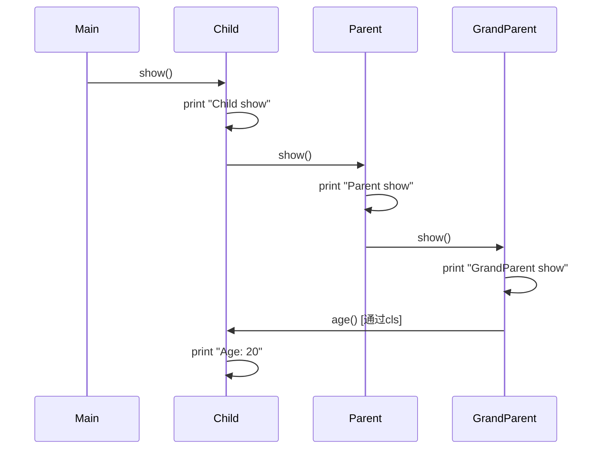

```python
class GrandParent:
    @classmethod
    def show(cls):
        print("GrandParent show")
        cls.age()

    @classmethod
    def age(cls):
        print("Age: 60")


class Parent(GrandParent):
    @classmethod
    def show(cls):
        print("Parent show")
        super().show()

    @classmethod
    def age(cls):
        print("Age: 40")


class Child(Parent):
    @classmethod
    def show(cls):
        print("Child show")
        super().show()

    @classmethod
    def age(cls):
        print("Age: 20")


if __name__ == "__main__":
    Child.show()

```

上面的python代码输出
```
Child show
Parent show
GrandParent show
Age: 20
```

解释一下。虽然在 `GrandParent.show()` 中调用的是 `cls.age()`，但由于是在 `Child` 上下文中执行，所以实际调用的是 `Child.age()`，因此最终输出的是 "Age: 20" 而不是 "Age: 60"

```
Child.show() --> prints "Child show"
             |
             +--> Parent.show() --> prints "Parent show"
                            |
                            +--> GrandParent.show() --> prints "GrandParent show"
                                           |
                                           +--> GrandParent.age() --> prints "Age: 20"
```

本来用mermaid时序图展示更清晰，但hugo原生不支持mermaid


要支持也不难，自定义模版加载额外js即可。参考 [Diagrams](https://gohugo.io/content-management/diagrams/#mermaid-diagrams)
* `render-codeblock-mermaid.html`放在`layouts/_markup`
* `layouts/baseof.html`从模版中复制后修改，例如hugo-PaperMod是`themes/hugo-PaperMod/layouts/_default/baseof.html`

我测过可行，但又撤销了。还是想让这个博客尽量简洁，能少加载一个js也好。另外重载`baseof.html`意味着多维护一个文件，主题升版本时多一个麻烦。罢了罢了